# Medical Image Processing Python Library

## Install

```bash
python setup.py install
```

## Usage

```py3
import pylib
path = 'sample.mhd'
img, array = pylib.ReadImage(path)
array = pylib.rot(array, axis='x', angle=90)
pylib.WriteImage(path)
```

Please refer to the [documentation](http://10.7.61.176:1234/docs/html/pylib.html#module-pylib) for more usages.

## Commit

Please read `commit.md` to commit the code to the repository.

# 程序库使用方法说明


- [程序库使用方法说明](#程序库使用方法说明)
	- [准备工作：注册与配置](#准备工作注册与配置)
	- [在 GitLab 中注册](#在-gitlab-中注册)
	- [安装 Git 客户端](#安装-git-客户端)
	- [配置 Git 客户端](#配置-git-客户端)
	- [下载程序库到本地](#下载程序库到本地)
	- [将本地程序库与远程程序库链接](#将本地程序库与远程程序库链接)
- [Workflow：修改、提交程序库](#workflow修改提交程序库)
	- [获取公共代码库远程仓库更新](#获取公共代码库远程仓库更新)
	- [修改本地仓库](#修改本地仓库)
	- [提交文件修改到本地仓库](#提交文件修改到本地仓库)
	- [提交本地仓库至远程仓库](#提交本地仓库至远程仓库)
	- [申请 Pull Request](#申请-pull-request)
- [代码规范：文件头、命名法及缩进](#代码规范文件头命名法及缩进)
	- [文件头](#文件头)
	- [命名法](#命名法)
	- [缩进](#缩进)
- [贡献统计：感谢对程序库的贡献](#贡献统计感谢对程序库的贡献)
	- [评价分数](#评价分数)
	- [奖励机制](#奖励机制)
- [总结：流程与命令一览](#总结流程与命令一览)
- [修改日志](#修改日志)

## 准备工作：注册与配置

本节内容只需要执行配置一次。

### 在 GitLab 中注册

使用、贡献代码库前，我们需要在 GitLab 中注册账户，[此处](http://10.7.13.35:8080/users/sign_in)进行注册。依次填写昵称，用户名，邮箱，密码，点击 Register 即可注册。

**注意**：GitLab 仅可在校园网范围内访问。

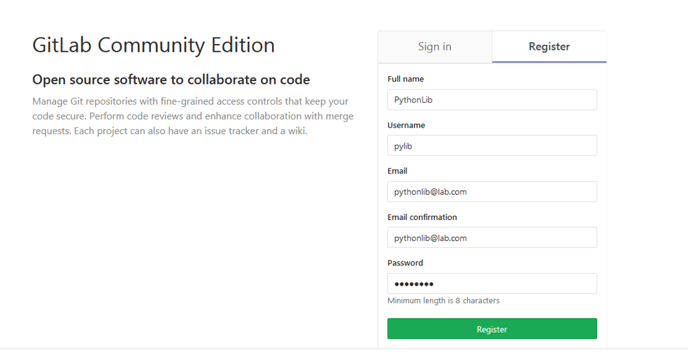

注册完成后，请点击[此处](http://10.7.13.35:8080/pylib/pythonlib)，将公共程序库 Fork 到自己的账户内。Fork 按钮位置如图所示。

修改 Fork 到自己账户内的仓库后，提交 Pull Request 请求，即可实现对公共程序库的修改。

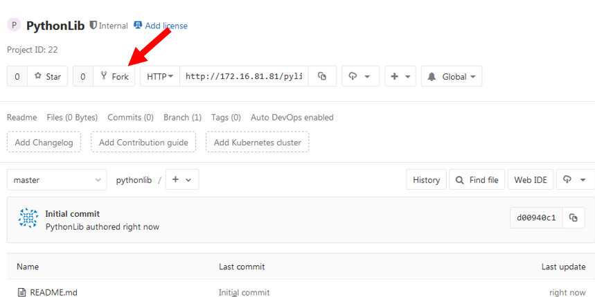

### 安装 Git 客户端

- Debian / Ubuntu: `sudo apt-get install git`

- Windows: 点击[此处](https://git-scm.com/download/win)进行 Git 安装包的下载。下载完成后，双击执行，一路下一步即可。安装成功后，文件夹或桌面内点击右键，选择 **Git Bash Here** 以在当前文件夹内运行 Git .

**注意**：推荐使用默认路径安装。

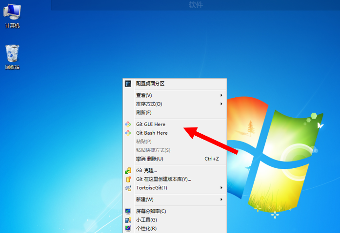

### 配置 Git 客户端

打开 Git Bash，依次输入命令，以配置用户名和邮箱。

```bash
git config --global user.name 在 GitLab 注册的用户名
git config --global user.email 在 GitLab 注册的邮箱
```

### 下载程序库到本地

在 Git Bash 中输入命令

`git clone http://10.7.13.35:8080/@Your_User_Name/pythonlib`

回车，即可下载程序库到本地。

**注意**：将地址中 “@Your_User_Name“ 换成自己的用户名。

### 将本地程序库与远程程序库链接

打开本地程序库文件夹，右键选择 Git Bash Here，在 Git Bash 中输入命令

`git remote add upstream http://10.7.13.35:8080/pylib/pythonlib`

回车，即将本地程序库和远程程序库进行连接。

## Workflow：修改、提交程序库

本节内容为日常开发流程。

### 获取公共代码库远程仓库更新

在修改和提交代码前，建议先检查远程公共代码库版本，对本地仓库进行更新。

打开本地程序库文件夹，右键选择 Git Bash Here，在 Git Bash 中按顺序执行以下三条命令：

```bash
git fetch upstream
git merge upstream/dev
git push origin dev
```

**注意**：为保证本地仓库和远程公共代码库版本保持最新且一致，对代码库提交前请务必先运行此命令，不然有潜在的文件冲突问题。平常没什么事儿也可以多次执行这几条命令。

### 修改本地仓库

在本地程序库文件夹中添加、删除、修改文件即可。

### 提交文件修改到本地仓库

本地仓库文件操作结束后，打开 Git Bash，按顺序执行以下两条命令：

```bash
git add .
git commit –m “Upload on 2019/05/24”
```

**注意**：执行命令后，在文件夹内可以观察到，文件**右下角的问号**会变为**绿色的对号**。

**注意**：应使第二条命令双引号内的内容（提交记录）有意义。

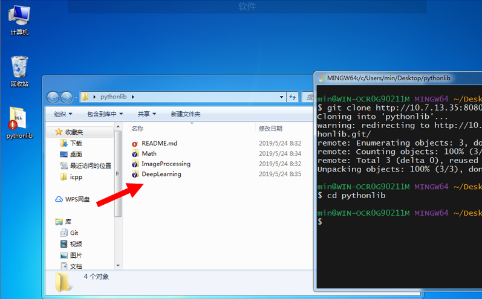

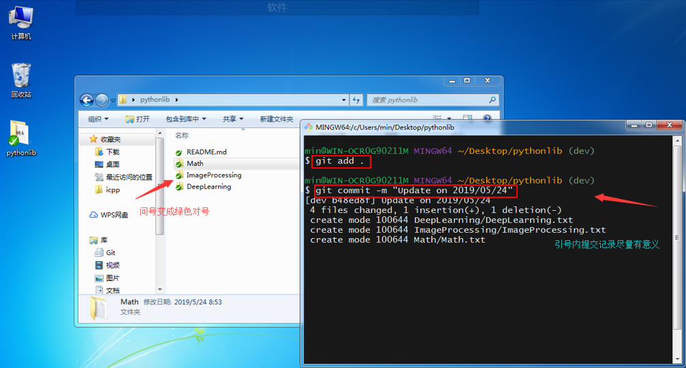

### 提交本地仓库至远程仓库

在 Git Bash 内执行以下命令：

`git push origin dev`

回车，输入用户名，在弹出框内输入密码，即可提交完成。

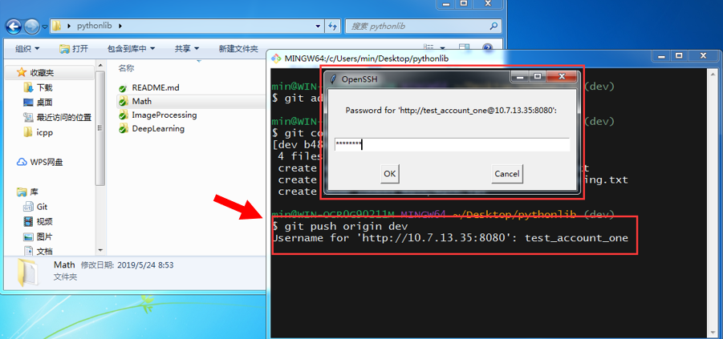

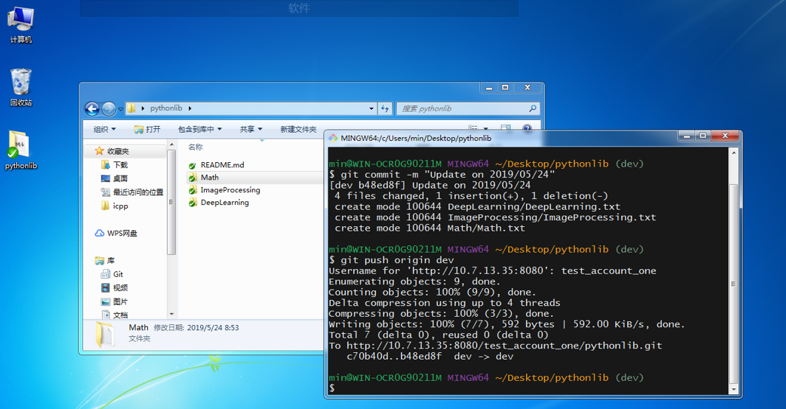

### 申请 Pull Request 

通过申请 Pull Request，可以将自己对代码库的修改提交至公共代码库。公共代码库管理员会进行 code review，若无问题，管理员将同意 Pull Request，至此完成一次代码库的更新。

申请 Pull Request 的步骤如下：

进入GitLab，选择 Fork 得到的项目，选择**合并请求（或 Pull Request）**选项，确保右侧源分支都为 **dev**，点击绿色按钮，进入申请页面，填写申请理由，点击提交即可。

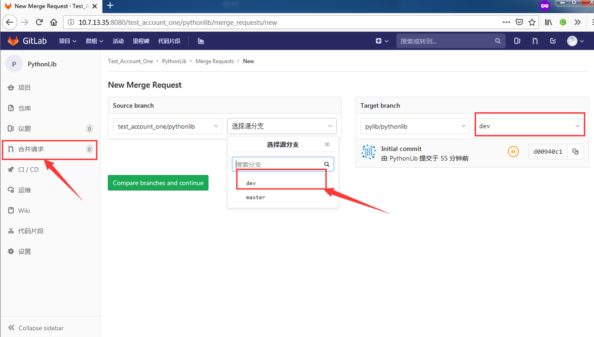

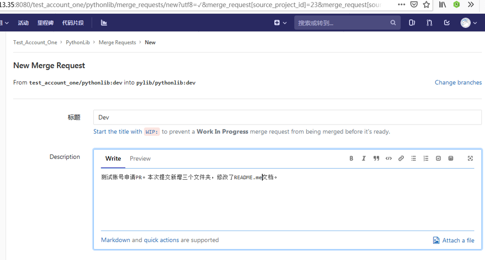

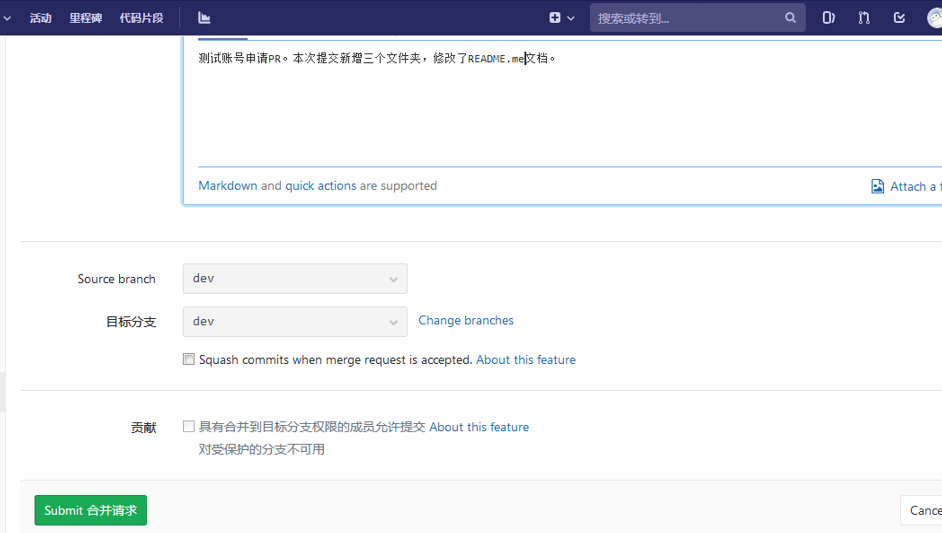

## 代码规范：文件头、命名法及缩进

### 文件头

文件头应用 Python 多行注释的形式添加在文件开头。文件头内容与格式如下。

```
Script Name:
Author:
Created:2019/05/24
Last modified:2019/05/25
Version:2
Modification:
Description:
```

Reference: /群文件/课题组相关/MedImg_Py_Library的访问方式.pdf

### 命名法

统一对类、函数、变量、文件名的命名。命名格式举例如下：

My_Python_Code.py

def Threshold_Segmentation()

class Image_Processing()

### 缩进

无论使用 Tab 按键还是空格，最终在程序中应体现为**四个空格**。

## 贡献统计：感谢对程序库的贡献

### 评价分数

评价分数计算公式：
$$
score = k_1 × 注释率 + k_2 × 代码行数+ k_3 × 贡献文件数
$$
其中各项系数待定。

### 奖励机制

待定。

## 总结：流程与命令一览
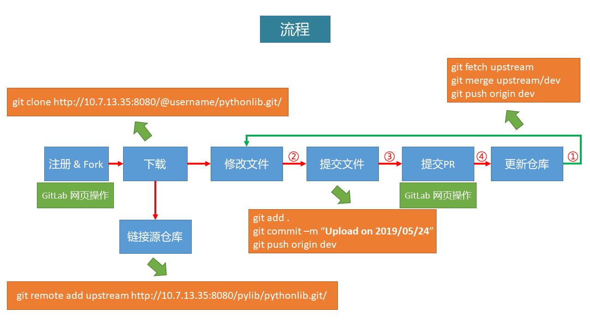

## 修改日志

2015/05/25，Version 1，韩冶，创建文档。